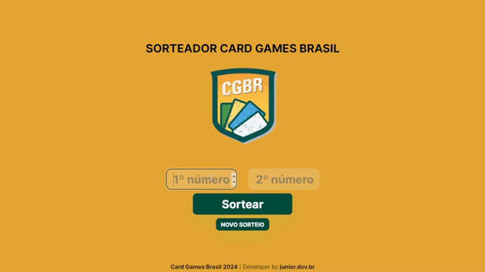

<h1>
      
    SORTEADOR CARD GAMES BRASIL
</h1>

## # O PROJETO

### Demonstração

Neste projeto, utilizei conhecimentos em HTML, CSS e JavaScript para desenvolver uma aplicação responsiva  que realiza o sorteio entre dois números pré determinados pelo usuário. 
Aproveitando que iria desenvolver tal aplicação para aprendizagem, resolvi usar o projeto para personalizar o layout para um amigo streamer, auxiliando na tarefa de fazer os sorteios que ele faz em seu canal. Ele utilizava um sorteador genérico, agora tem um próprio e personalizado para seu canal para fazer os sorteios ao vivo sempre que precisar.

## # APRENDIZADO

Pude neste projeto, trabalhar com a reprodução de áudio em determinados momentos, no caso ao clicar em um botão, um determinado áudio é disparado, e depois um outro com um "atraso", que é necessáario para que os sons toquem de acordo com o desejado... Primeiro um som de rufar de tambores é disparado assim que o botão "sortear" é clicado, após 2 segundos outro som, desta vez personalizado com a voz do streamer dizendo uma frase iconica do seu canal é disparado e o resultado do sorteio aparece na tela.  
Aprendi também um recurso bem interesante de desenhar os confetes na tela, para que quando o resultado do sorteio seja exibido, também haja uma "festa" na tela do usuário.

## 🚀 Sobre mim
Olá, eu sou o Junior!

Sou graduando em Analise e Desenvolvimento de Sistemas pela Universidade Paulista (UNIP). Me especializando em frontend com HTML, CSS, JavaScript, TypeScript, React, Next.js, Vue.js e TailwindCSS que são as ferramentas que atualmente mais uso no meu cotidiano. Tenho experiência em desenvolvimento de sites responsivos buscando o melhor desempenho nos diferentes dispositivos.

## 🔗 Links

